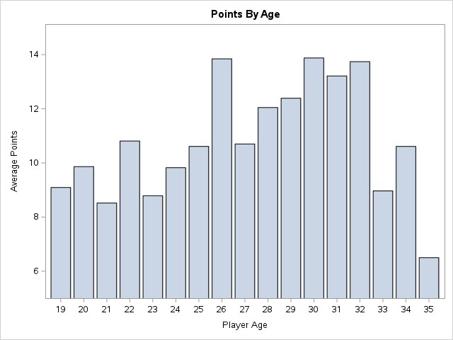
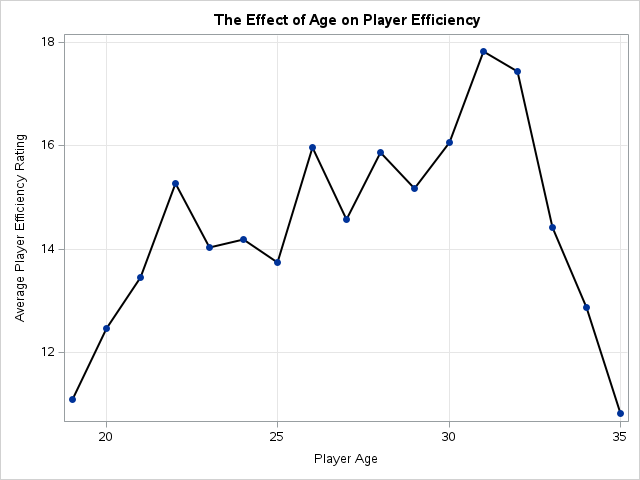
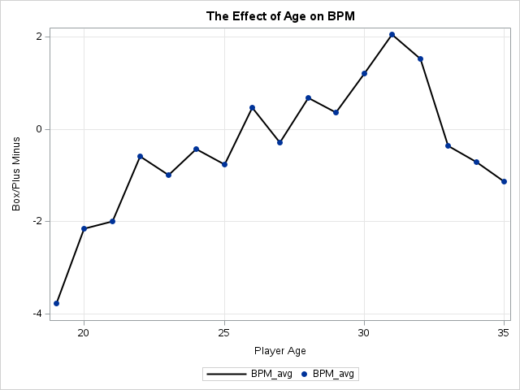
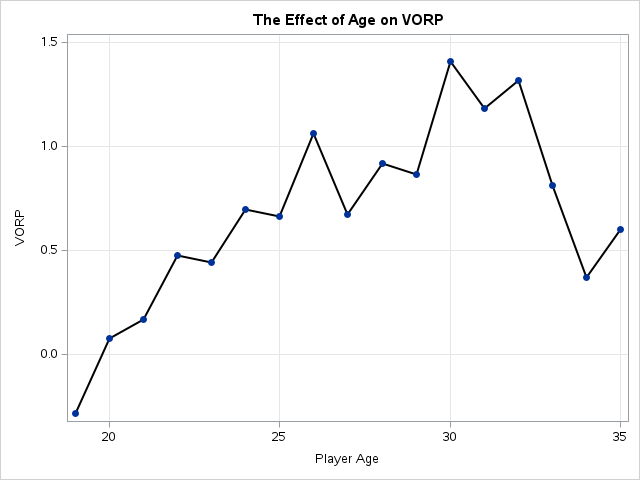

# NBA Player Performance Analysis

## Author
Justin Gould

## Overview
Analyzed how age impacts NBA player performance using SAS and data from three NBA datasets.

## Research Question
How does age impact NBA player performance?

## Tools & Skills
- SAS
- Microsoft Excel
- Data Integration
- Data Cleaning
- Exploratory Data Analysis
- Data Visualization

## Data Processing
- Imported three NBA datasets
- Merged datasets using player ID
- Standardized variable types and names
- Removed inactive players and outliers
- Filtered the dataset for analysis

## Key Findings
- Players ages 26–32 generally showed the strongest performance.
- PER, Points, VORP, Steals, and BPM were among the strongest-performing metrics.
- Several metrics showed particularly strong performance around ages 30–31.

## Visualizations

### Points by Age

### Player Efficiency Rating by Age

### Box Plus Minus by Age

### VORP by Age

## Project Files

- [SAS Analysis Code](src/nba_player_analysis.sas)
- [Full Project Report](nba_player_analysis_report.pdf)

## Data

The analysis uses three original NBA datasets:

- [Advanced Statistics](data/advanced_stats.csv)
- [Per-Game Statistics](data/per_game_stats.csv)
- [Player Salary](data/player_salary.csv)
